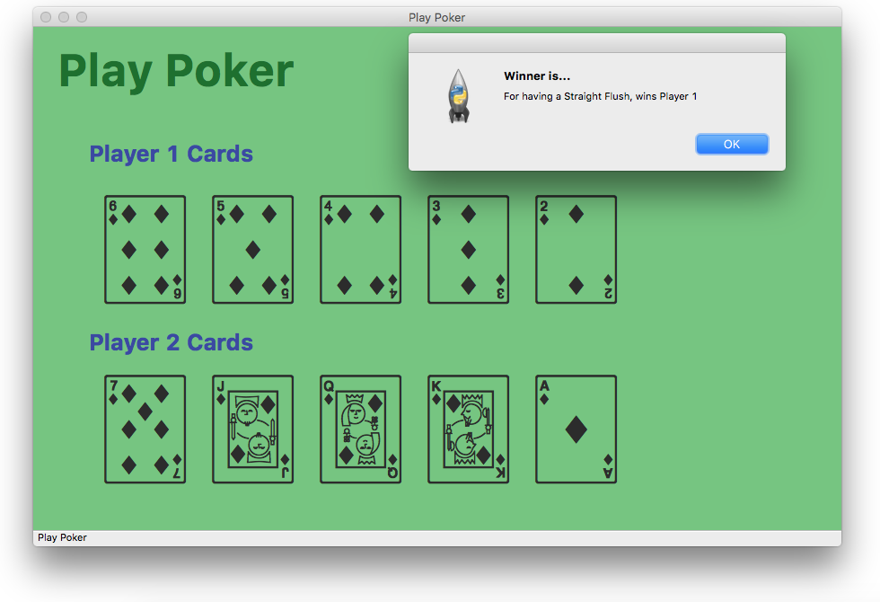
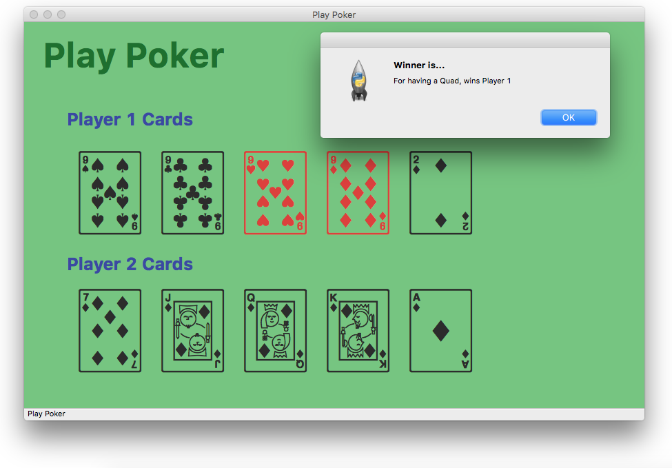
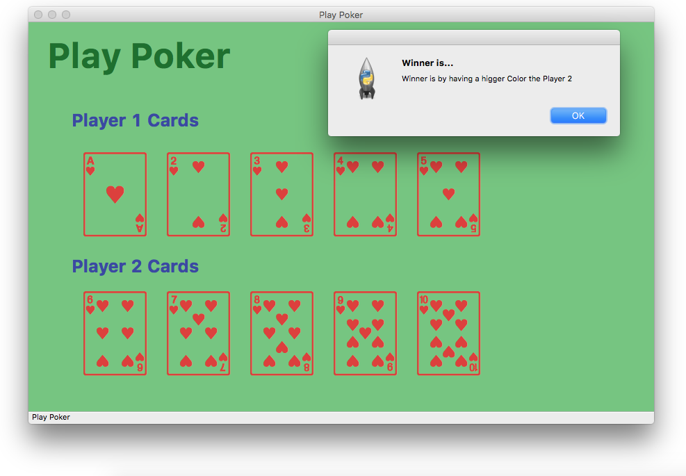
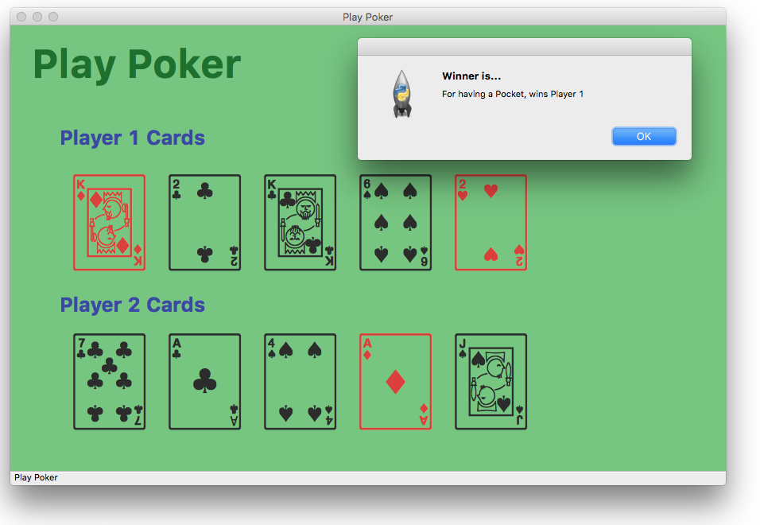
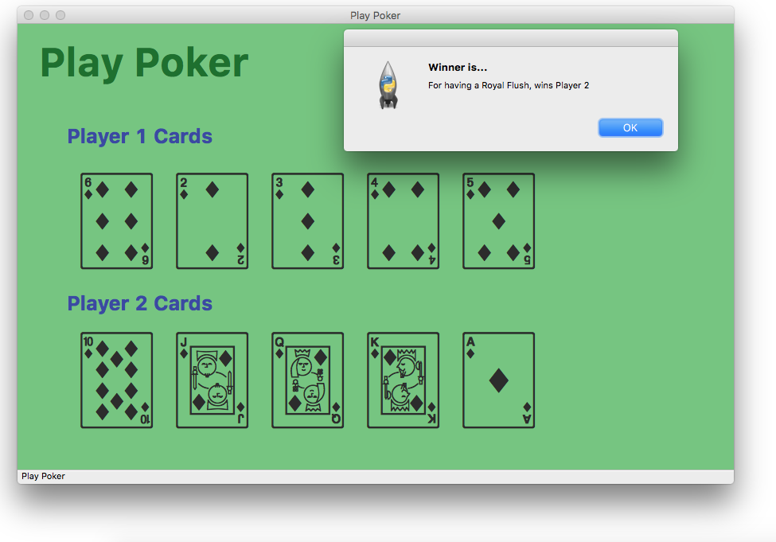
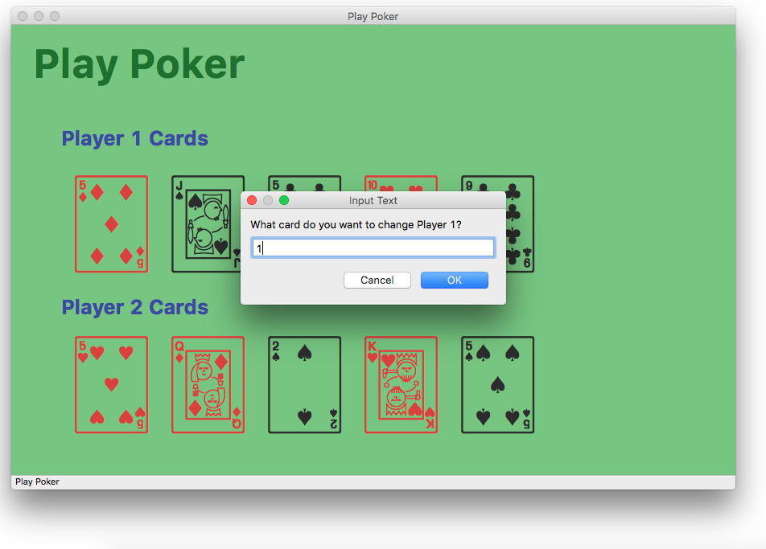

# Play Poker
A simple app to play poker, It hace options for 2 players and for change cards.


## To Play
```
$python3.6 PlayPokerApp.py
```

Remember to have install wxPython :D in https://wxpython.org

## ScreenShots













### Author

[SoyOscarRH](https://github.com/SoyOscarRH) - Oscar Andrés Rosas Hernandez
Ciencias de la Computación - 417024956


